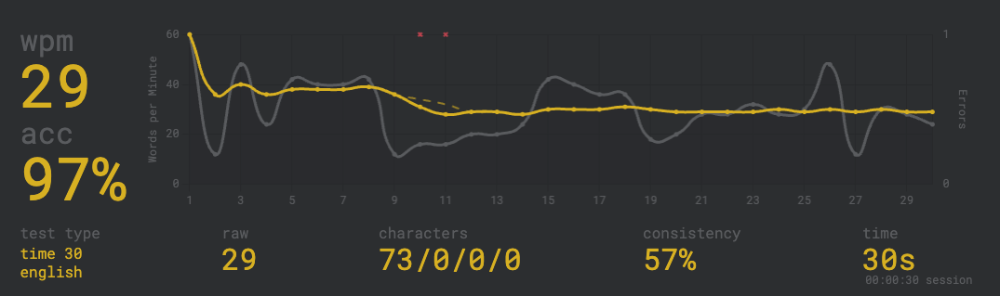

# Weekly Journal
27 November 2025
~~Your name here~~

## Typing

> Drop your screenshot here:

## Linear Search

> Hidden in one house is a treasure. Using human language, describe how you would use linear search to find the treasure. To help, try making a numbered, step-by-step procedure. Also, consider which house you would start and end at.

1. create a list of all house
2. check though all house using `for` and `if`

## Thanksgiving and Black Friday

> Have you ever bought something during a Black Friday sale?

not yet

> Are you keeping your eye out on something for this Black Friday? If so, what?

no