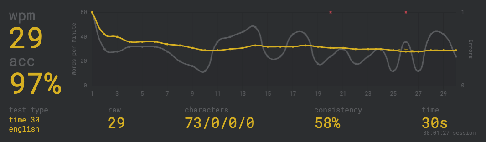

# Weekly Journal
12 December 2025
Alex Hsiao

## Typing

## Classes and Objects

> Imagine we're describing a tree. What properties would you use to describe a tree? (This is similar to the exercise that we did in class yesterday, finding ways to use properties to describe Pokemon.) You can use bullet points.

- Shape of leafs
- Color of leafs
- Height
- Shapes🌲/🌳
- Color of wood
- Age
- Width of trunk
- Altitude and latitude it can grow

## Holidays

> What are your plans for the winter holidays?

sleep 24/7

